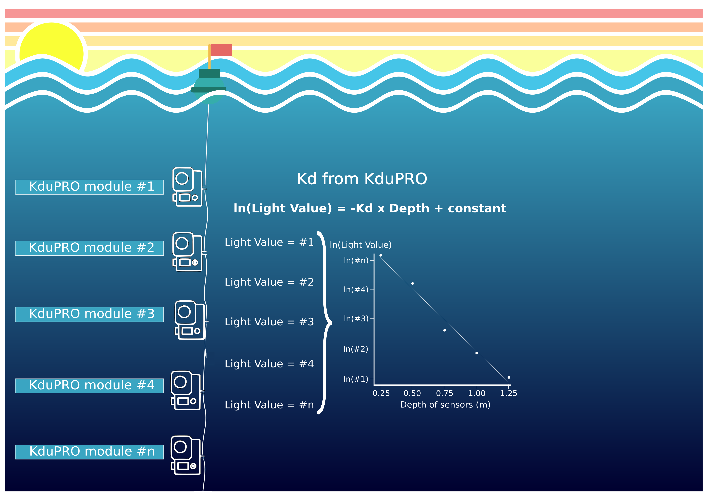
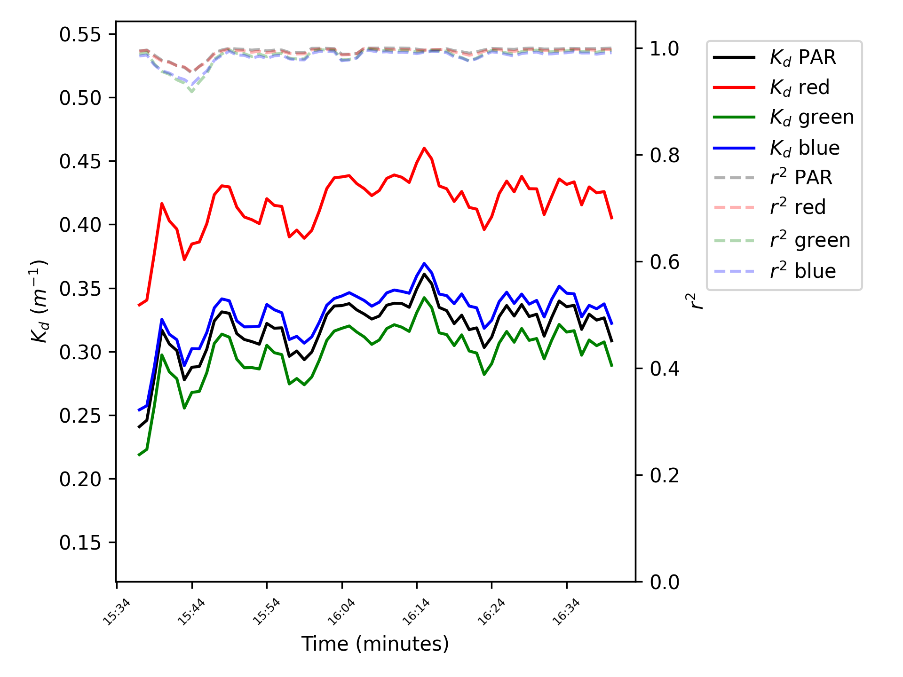
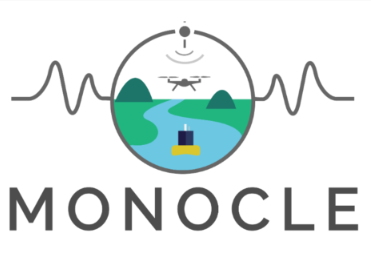

# KduPRO

KduPRO [Rodero et al, 2022](http://dx.doi.org/10.3389/fmars.2022.1004159) is a low-cost and do-it-yourself moored system evolved from the KdUINO [Bardaji et al, 2016](https://doi.org/10.3390/s16030373) which estimates the water transparency.

It is based on a modular system of light sensors, independent of each other, measuring the irradiance at different depths. The depth of each module can be modified according to the requirements of the project or the environment, offering the user a custom array of sensors. 

The KduPRO measures the light intensity in the red, green, blue and PAR (Photosynthetically Active Radiation) bands. The configuration of the KduPRO brings the possibility to calculate the Kd (the diffuse attenuation coefficient) with one module doing a vertical profile or with an array of modules as a moored buoy. 

The affordable cost, along with ease of build and use, make this instrument a valuable tool for anyone interested in getting involved in water quality monitoring programs.

<iframe width="560" height="315" src="https://www.youtube.com/embed/Matevkip44U" title="YouTube video player" frameborder="0" allow="accelerometer; autoplay; clipboard-write; encrypted-media; gyroscope; picture-in-picture; web-share" allowfullscreen></iframe>

## Installation

This repository contains the [firmware](./firmware) developed with the PlatformIO IDE extension. 

The [User’s guide and technical documentation](https://zenodo.org/record/5721155) of the KduPRO includes an installation section with the hardware components and the steps to build it. Also includes the guide of the software setup to upload the code into the microcontroller.  

## Data analysis

The [Kduino Data Analysis](https://git.csic.es/kduino/kduino-data-analysis) is a python module designed for opening and analyzing data files from KdUINO instrumentation (such as the KduPRO). Also, it provides methods to generate plots and convert data files into netCDF, csv, json and pickle format.

## License

[MIT](LICENSE)

This project has received funding from the European Union's Horizon 2020 research and innovation programme under grant agreement No 776480 (MONOCLE).
